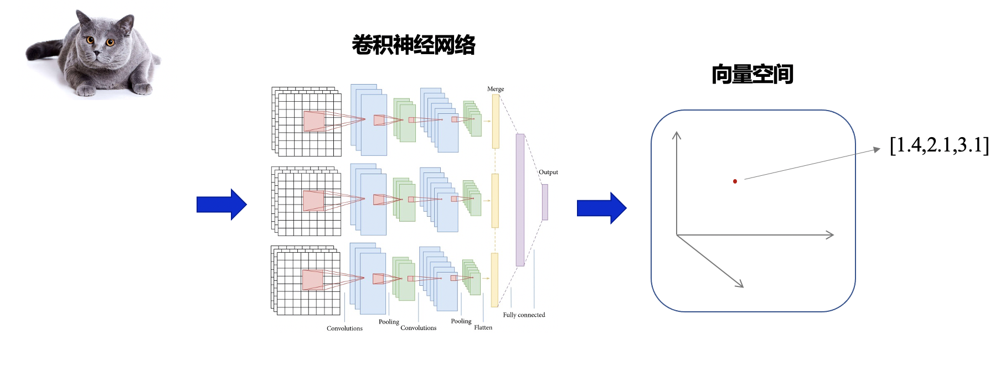
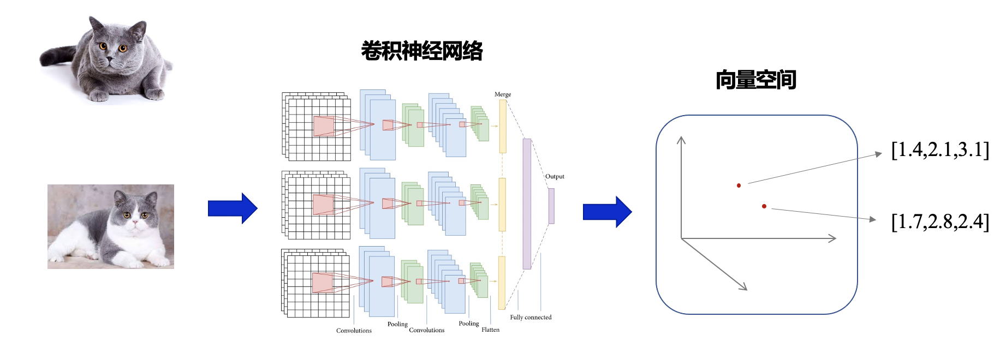
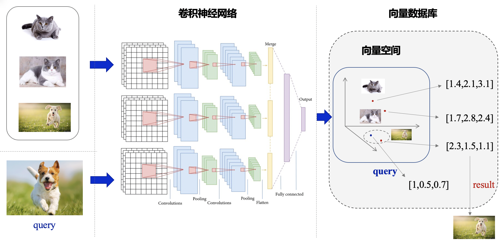
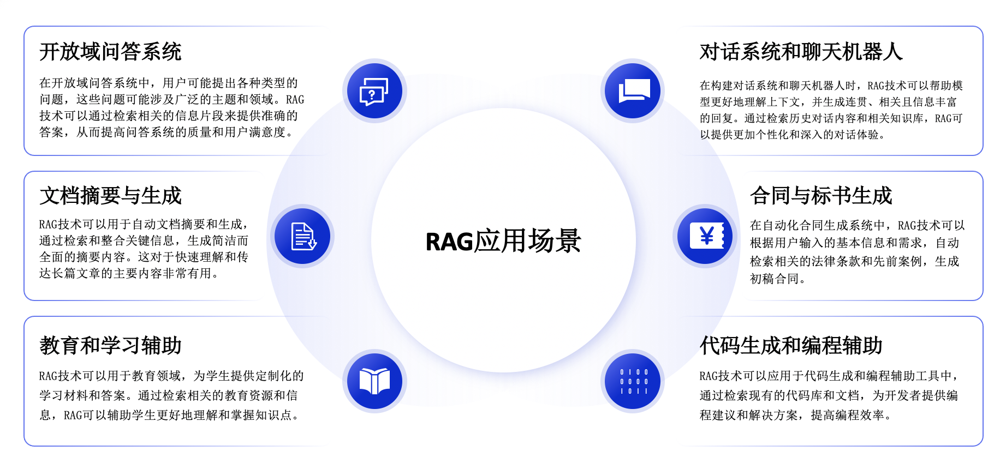

# 什么是向量检索

大语言模型（LLM）的出现让本来小众的向量检索技术从幕后走到了台前，得到了大家极大的关注。本教程的目的就是希望帮助大家全方面的了解向量检索领域的基础概念，主要研究方向以及未来潜在的发展前景，虽然向量检索目前作为检索增强生成（RAG）的一个重要组件被大家应用在了基于LLM的知识库问答等场景下，但也要注意的是向量检索本身在”搜、广、推“等场景下也有着广泛的应用，下面就让我们开始向量检索的技术揭秘吧。

## 向量检索的基本概念

向量检索技术其实对于大家来说并不陌生，相信大家应该都用过淘宝的”拍立淘“，Google 的以图搜图，这些背后都是通过向量检索技术来实现的。

想象一下，在互联网的广阔海洋中，每一句话都是一颗星星，而我们需要找的不仅仅是特定的词汇，而是那些能够发出相似光芒、表达相似意义的星群。传统的关键词搜索就像是通过望远镜寻找特定颜色的星星，它可能会因为关键词的限制而错过那些含义相近但用词不同的星星。向量检索不直接搜索特定的词汇，而是将这些话语转化为向量，即在多维空间中的点。

这样，当你尝试寻找关于“勇气”的内容时，向量检索不仅能够识别出明确使用了“勇气”一词的句子，还能够发现那些描述“英雄行为”、“无畏面对困难”等含义相近但表述不同的内容。这就像在夜空中寻找不仅亮度相似，而且在空间中彼此靠近的星群，即使它们的颜色不完全相同。

通过理解和比较这些向量的距离和方向，向量检索能够揭示出深层的语义联系，使得即便是用不同词汇表达的思想和概念也能被轻松捕捉。这种技术让搜索变得更加智能化，不仅提升了效率，还增加了探索未知的乐趣，使得我们能够在这广阔的信息宇宙中，发现那些真正意义上与我们查询意图相匹配的星辰。

## 关键词检索与向量检索的原理对比（TODO：添加技术原理）

关键词检索依赖于文档中的单词频率来评估文档的相关性，常见于传统的搜索引擎。而向量检索则关注于数据的语义表示，即使文档中没有直接包含查询词，只要语义相近，也能被检索到。例如，在向量空间中，“土豆”和“马铃薯”虽然是不同的词，但由于它们语义上的接近，它们的向量表示会相似。

## 向量检索的应用场景

# 向量检索为什么重要

## 海量非结构化数据对智能化检索的需求

随着数字内容的爆炸性增长，传统的关键词搜索方法在处理海量非结构化数据时面临挑战。向量检索能有效管理这些数据，提供更精准、高效的检索方式。

## 向量化表示在捕捉数据语义方面的优势

通过向量化表示，可以捕捉数据的深层语义信息，使得检索结果更加相关。例如，在文档检索中，向量化可以帮助理解查询的意图，而不仅仅是表面的词匹配。

## 向量检索在个性化推荐、语义搜索等场景下的价值

向量检索技术可以应用于个性化推荐系统，根据用户的行为和偏好，推荐内容更加个性化、精准。在语义搜索场景下，向量检索通过理解查询的深层意图，提供更加丰富和精确的搜索结果。

## 向量检索技术在工业界的落地现状与发展前景

各大科技公司和研究机构纷纷投入资源研发向量检索技术，应用于电商推荐、社交媒体、新闻聚合等多个领域。随着人工智能技术的不断进步，向量检索的应用场景将更加广泛，技术更加成熟。

# 本教程适合的人群

本教程旨在通过浅显易懂的语言和生动的案例，由浅入深全面介绍向量检索的原理、重要研究方向与实践案例。无论是向量检索的初学者，还是希望深化理解的研究人员和开发者，都能从本教程中获得有价值的知识和技能。我们将通过丰富的实例、代码演示和拓展阅读资料，确保读者能够深入理解向量检索的概念、原理及其在实际应用中的运用。

- 教程将由浅入深，循序渐进地介绍向量检索的原理、重要研究方向与实践案例。
- 教程适合无基础的初学者，也能满足研究人员和开发者的进阶需求。我们将提供基础知识点的详细解释，并引导读者探索更深层次的研究内容和技术挑战。
- 通过本教程的学习，读者将建立起向量检索的完整知识体系，并具备开发实际应用的能力。读者可以学习如何构建自己的向量检索系统，以及如何优化和调试现有的系统以满足特定的需求。
